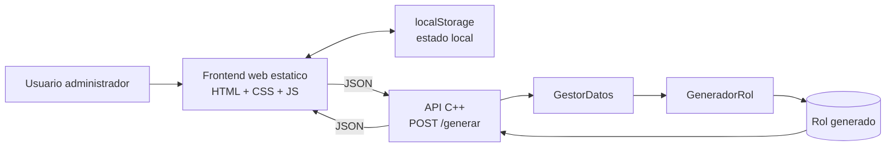

# Arquitectura

## Vista general

## Capas

### Presentacion

- Renderiza formularios y tablas.
- Mantiene estado local de guias, salas, capacitaciones y roles previos.
- Exporta el rol a CSV.

### Aplicacion

- Expone un unico endpoint `POST /generar`.
- Parsea JSON, invoca el motor y serializa la respuesta.

### Dominio

- `GestorDatos` transforma el payload en estructuras C++.
- `GeneradorRol` aplica la logica de negocio.

## Observaciones de arquitectura

- No existe base de datos real en el estado actual.
- La persistencia del frontend depende de `localStorage`.
- El backend esta desacoplado de la UI por JSON, lo cual facilita futuras integraciones.
- El endpoint remoto esta hardcodeado en el frontend actual.

