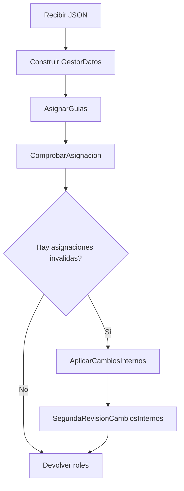
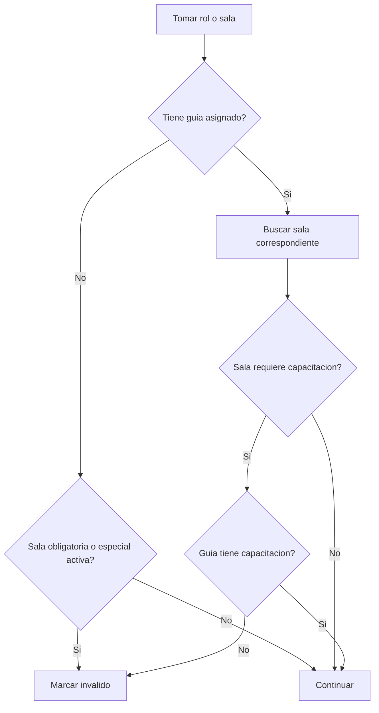

# Flujo de generacion

## Flujo principal del backend

## Flujo de decision por cada sala

## Resumen funcional

1. Se genera una rotacion base.
2. Se valida cada asignacion.
3. Si una sala queda mal cubierta, se busca un reemplazo valido.
4. El cambio interno queda registrado sin perder trazabilidad del rol original.
