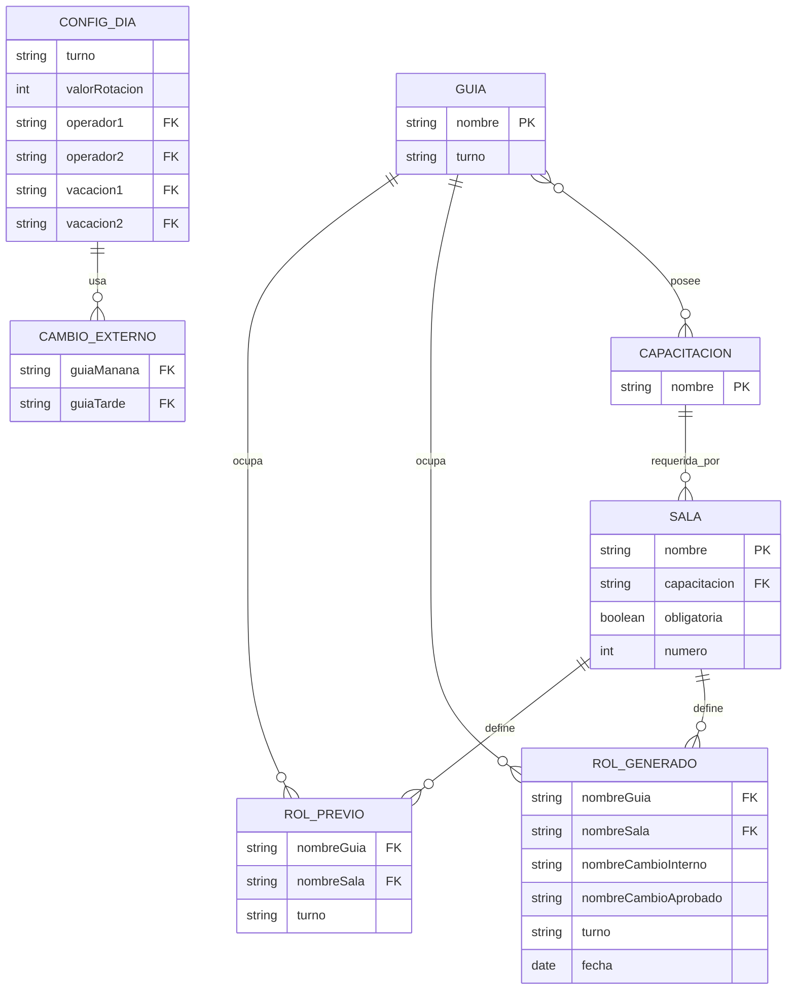

# Modelo de datos y ERD logico

## Aclaracion

Hoy no existe una base de datos relacional implementada en el repo. Aun asi, si se quisiera persistir el sistema, este es el modelo logico que surge del codigo actual.

## ERD logico

## Correspondencia con el codigo

- `Guia`, `Sala`, `Rol`, `RolGenerado`, `Cambio`, `Operadores` y `Vacaciones` viven en [`Backend/GestorDatos.hpp`](../../Backend/GestorDatos.hpp).
- Las salas especiales `operador1`, `operador2`, `vacaciones1` y `vacaciones2` se agregan dinamicamente en [`Backend/GestorDatos.cpp`](../../Backend/GestorDatos.cpp).
- Tambien se agregan salas `fueraRolN` si sobran guias para el turno.

## Implicaciones

- El modelo actual favorece flexibilidad en memoria.
- Si se migra a BD, sera clave separar catalogos, configuracion diaria y resultados historicos.
