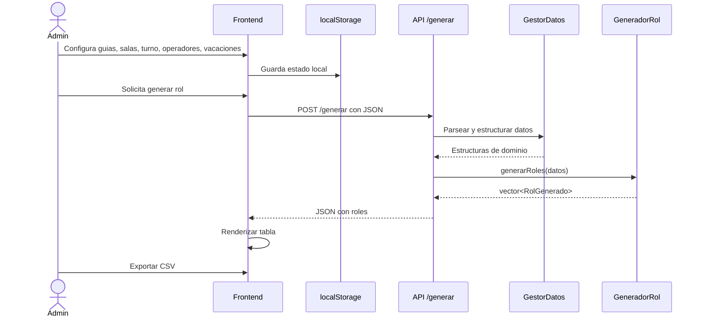

# Secuencia API

## Secuencia entre frontend y backend

## Notas

- El frontend mantiene memoria local de roles previos por turno.
- El backend no persiste informacion entre solicitudes.
- El contrato entre ambas capas es enteramente JSON.
