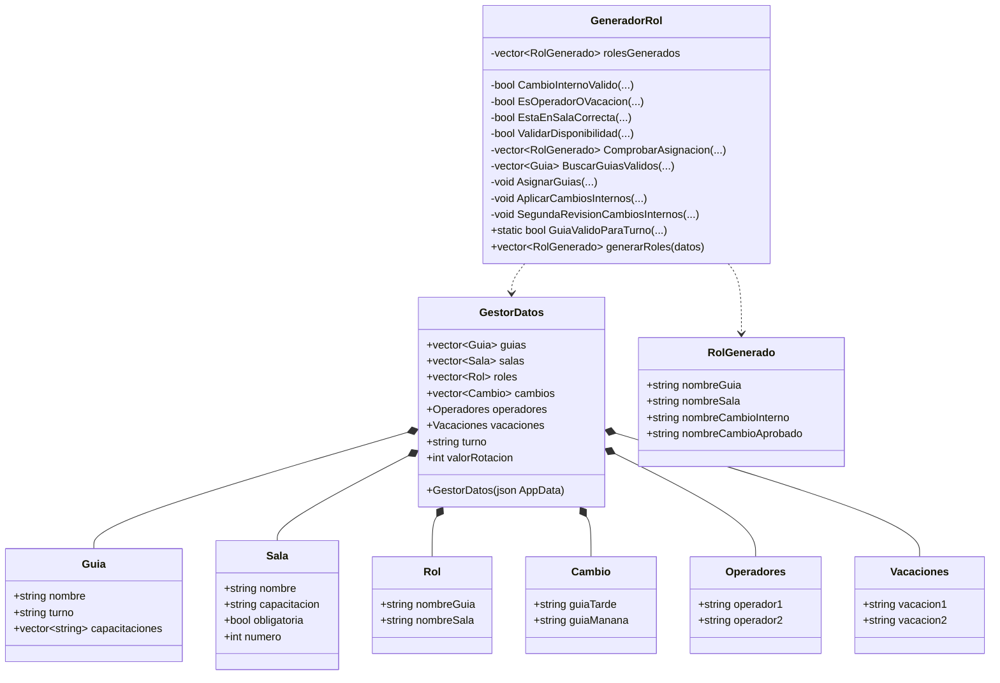

# UML de clases

## Clases principales

## Lectura rapida

- `GestorDatos` es el punto de entrada del modelo.
- `GeneradorRol` es el servicio de dominio que orquesta la asignacion.
- `RolGenerado` extiende el concepto de `Rol` con trazabilidad de cambios.

