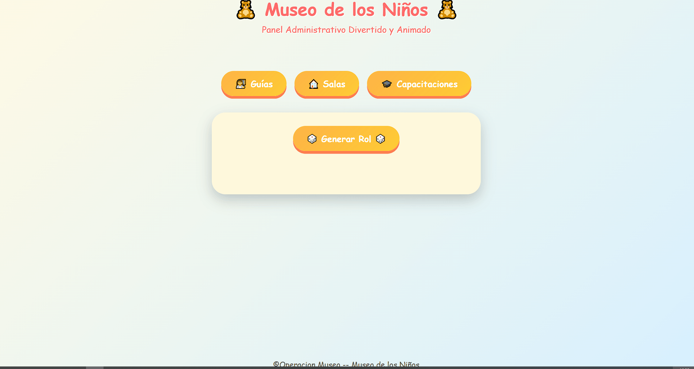
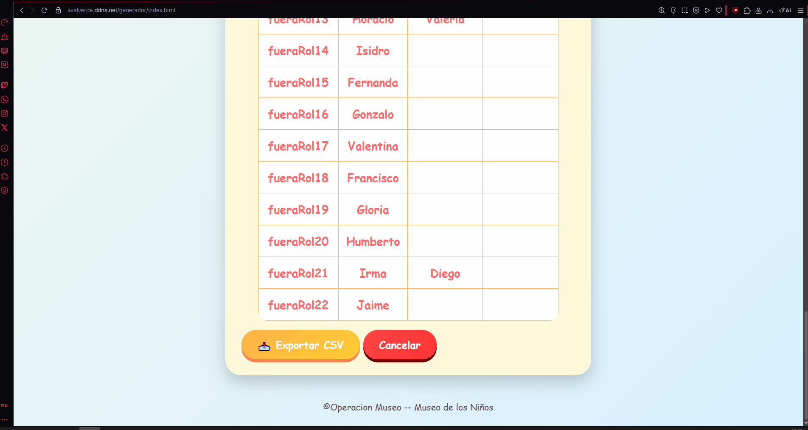

# GeneradorRol


GeneradorRol es un sistema para construir roles diarios de guias por sala, con reglas de negocio orientadas a operacion real: rotacion del rol previo, filtrado por turno, salas obligatorias, capacitaciones, operadores y vacaciones.

El proyecto esta dividido en un frontend web ligero y un backend en C++ que expone una API para generar el rol final del dia a partir de un payload JSON.

## Descripcion

La aplicacion permite administrar:

- Guias y sus turnos
- Salas y si son obligatorias
- Capacitaciones requeridas
- Operadores del dia
- Vacaciones del dia
- Rotacion base del rol
- Roles previos por turno

Con esos datos, el backend genera una asignacion inicial y luego intenta corregir internamente los casos invalidos sin romper la trazabilidad del rol base.

## Caracteristicas

- Generacion automatica de roles por turno
- Rotacion respecto al rol anterior
- Validacion de capacitaciones por sala
- Manejo de operadores y vacaciones como casos especiales
- Correcciones internas cuando una asignacion no cumple reglas
- Persistencia local en navegador mediante `localStorage`
- Exportacion del rol generado a CSV
- API HTTP para desacoplar la UI del motor de asignacion

## Tecnologias

- C++17
- Crow
- nlohmann/json
- cpp-httplib
- Asio
- HTML
- CSS
- JavaScript
- Docker

## Arquitectura

El sistema sigue una arquitectura simple en 3 capas:

1. Frontend estatico en [`Frontend/`](Frontend) para administrar datos y disparar la generacion.
2. API en C++ en [`Backend/api.cpp`](Backend/api.cpp) que recibe JSON y responde JSON.
3. Motor de dominio en [`Backend/GeneradorRol.cpp`](Backend/GeneradorRol.cpp) y [`Backend/GestorDatos.cpp`](Backend/GestorDatos.cpp).

Resumen del flujo:

1. El frontend arma el payload desde su estado local.
2. Se hace `POST /generar`.
3. `GestorDatos` normaliza la entrada.
4. `GeneradorRol` aplica rotacion, validacion y correcciones internas.
5. La API devuelve el rol final para mostrarlo y exportarlo.

La documentacion extensa y los diagramas estan en [docs/README.md](docs/README.md).

## Estructura del proyecto

```text
GeneradorRol/
|-- Backend/
|   |-- api.cpp
|   |-- GeneradorRol.cpp
|   |-- GeneradorRol.hpp
|   |-- GestorDatos.cpp
|   `-- GestorDatos.hpp
|-- Frontend/
|   |-- index.html
|   |-- script.js
|   `-- style.css
|-- docs/
|   |-- README.md
|   |-- diagramas/
|   |-- manuales/
|   |-- investigaciones/
|   `-- pdfs/
`-- Dockerfile
```

## Instalacion

### Opcion 1: Docker

El repo incluye [`Dockerfile`](Dockerfile) para compilar el backend dentro de un contenedor Ubuntu.

```bash
docker build -t generador-rol .
docker run --rm -p 18080:8080 generador-rol
```

Nota importante:

- El binario expone internamente el servidor Crow en el puerto `8080`.
- El `Dockerfile` expone `18080`.
- El backend esta configurado para usar certificados SSL en `/app/certs/fullchain.pem` y `/app/certs/privkey.pem`.

Antes de usar esta via conviene alinear puertos y certificados con tu entorno real.

### Opcion 2: ejecucion manual del backend

Si ya tienes las dependencias disponibles:

```bash
g++ -std=c++17 Backend/api.cpp Backend/GeneradorRol.cpp Backend/GestorDatos.cpp -Icrow -Inlohmann -Icpp-httplib -Iasio -o api -lpthread -lssl -lcrypto -DCROW_ENABLE_SSL
./api
```

### Frontend

El frontend es estatico. Puedes abrir [`Frontend/index.html`](Frontend/index.html) en el navegador o servirlo desde cualquier servidor web.

Nota importante:

- En el estado actual, el frontend hace `fetch` a `https://araxus.ddns.net:18080/generar`.
- Si quieres trabajar en local, deberas ajustar ese endpoint en [`Frontend/script.js`](Frontend/script.js).

## Uso

1. Administra guias, salas y capacitaciones desde la interfaz.
2. Selecciona turno, operadores, vacaciones y valor de rotacion.
3. Genera el rol del dia.
4. Revisa cambios internos sugeridos por el motor.
5. Exporta el resultado en CSV.

## Capturas

### Vista general del panel


### Flujo de generación del rol


### Exportación CSV


## API

### Endpoint

```http
POST /generar
Content-Type: application/json
```

### Entrada esperada

```json
{
  "turno": "entresemana manana",
  "valor": 2,
  "guias": [],
  "salas": [],
  "roles": [],
  "cambios": [],
  "operadores": {
    "operador1": "",
    "operador2": ""
  },
  "vacaciones": {
    "vacacion1": "",
    "vacacion2": ""
  }
}
```

### Respuesta

```json
{
  "roles": [
    {
      "nombreGuia": "Ana",
      "nombreSala": "Radio",
      "nombreCambioInterno": "",
      "nombreCambioAprobado": ""
    }
  ]
}
```

## Documentacion

La carpeta [`docs/`](docs) incluye:

- Diagramas UML
- Diagramas de flujo
- Arquitectura
- Estructura de clases
- Modelo de datos / ERD logico
- Explicacion del algoritmo de generacion
- Decisiones tecnicas
- Manuales operativos y de despliegue
- Espacio para futuras exportaciones a PDF

## Roadmap

- [ ] Desacoplar configuracion de endpoint del frontend
- [ ] Anadir persistencia real con base de datos
- [ ] Incorporar cambios externos entre turnos
- [ ] Agregar tests automaticos del motor
- [ ] Resolver empaquetado consistente de SSL y puertos
- [ ] Crear modo local sin dependencia de endpoint remoto

## Aprendizajes

Este proyecto ya refleja varios aprendizajes valiosos:

- Pensamiento estructurado
- Capacidad de modelar problemas reales
- Integracion entre frontend y backend
- Capacidad de trabajar con reglas de negocio
- Documentacion tecnica
- Mentalidad de mejora iterativa
- Criterio para detectar deuda tecnica

## Conceptos aplicados

- Arquitectura cliente-servidor
- API REST
- Separacion de responsabilidades
- Modelado de reglas de negocio
- Serializacion JSON
- Persistencia local
- Dockerizacion
- Validacion de restricciones
- Algoritmos de asignacion

## Estado actual

El sistema es funcional como prototipo avanzado / base operativa, pero todavia muestra areas de evolucion claras: persistencia real, pruebas, configuracion de despliegue y formalizacion de cambios externos.
